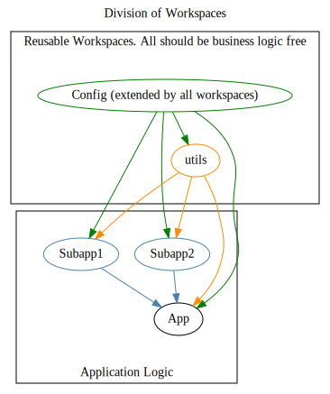

# Test Workspaces

The purpose of this repository is to POC `pnpm` workspaces with an ejected `create-react-app`.

## The problem being solved

1. A monorepo that
   - has distinct subapps, but share library code
   - has many circular dependencies and unclear deliniations between business and library code
   - has subapps and code section that can be more or less legacy, but newer code cannot implement rules for tighter code standards without fixing all violations in legacy code
2. Long-running tests and ci checks must be performed on the entire repository, regardless of the area that changed
3. Currently, this monorepo has one redux store, which makes breaking it up difficult. All subapps share app code like session and user info through redux
4. Each subapp shares a single navigation element that imports from each subapp
5. The release of one subapp is only possible with the release of the entire monorepo, i.e. subapps cannot be versioned.

## The solution being tested

This POC repository may not solve all of the above problems, but it will attempt to solve the first issues and move through one at a time.

1. Break the monorepo into workspaces using `pnpm`.
   - Define the inheritence relationship of workspaces (they cannot be circularly required) and isolate library code so that business logic cannot sneak in
   - Clarify the dependency graph, isolating library code (`utils`) from business code (`app`, `subapp1`, `subapp2`).
   - Give each workspace its own tests, eslint rules (extended from a base config), tsconfig (extended from a base config) will allow different rulesets and tighter/looser rules on legacy subapps vs modern subapps.
   <!--

```
@startuml
digraph Workspaces {
    label="Division of Workspaces"
    labelloc=t

    subgraph cluster_reusable_workspaces {
        label="Reusable Workspaces. All should be business logic free"
        margin=30

        config [color="green", label="Config (extended by all workspaces)"]
        utils [color="darkorange"]

    }
    subgraph cluster_apps {
        label="Application Logic"
        margin=30
        labelloc=b
        config -> {utils;Subapp1;Subapp2;App} [color="green"]
        utils -> {Subapp1;Subapp2;App} [color="darkorange"]
        {Subapp1;Subapp2} -> App [color="steelblue"]
        Subapp1 [color="steelblue"]
        Subapp2 [color="steelblue"]
    }
}
@enduml
```

-->


The rest is WIP
